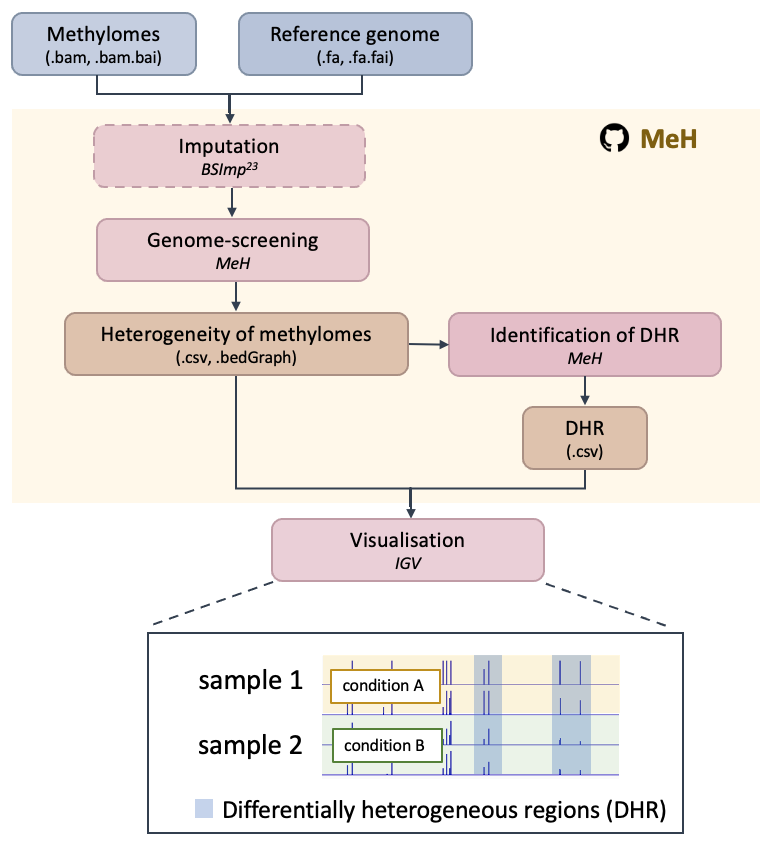

# MeH :sheep:

:mega: DNA methylation heterogeneity measures the epigenetic diversity within a cell population where the behaviour of individual cells can vary as differential responses to the environmental stimuli or dynamic progression of cellular development.

                            


<p align="center"></p>


### Publication

[Estimating methylation heterogeneity in bisulfite sequencing data by mathematical modelling. journal. doi: (2021)]()

## Pipeline

<p align="center"></p>

### Documentation

MeH users guide is available as a [PDF file](./Manual.pdf), containing the detail of each step. For questions please open an issue on [GitHub](https://github.com/britishcoffee/MeHscr/issues) or [contact me](#contact).

### Tutorial

Please follow the [tutorial](./Tutorial.md) of example use case.


##  Table of Contents

- [MeH :sheep:](#meh-sheep)
    - [Publication](#publication)
  - [Pipeline](#pipeline)
    - [Documentation](#documentation)
    - [Tutorial](#tutorial)
  - [Table of Contents](#table-of-contents)
  - [System requirements](#system-requirements)
  - [Installation](#installation)
  - [Methylation heterogeneity profiling](#methylation-heterogeneity-profiling)
        - [Input](#input)
        - [Usage](#usage)
        - [Example](#example)
        - [Output](#output)
  - [Visualization of MeH](#visualization-of-meh)
        - [Input](#input-1)
        - [Usage](#usage-1)
        - [Example](#example-1)
        - [Output](#output-1)
  - [Subsequent analysis](#subsequent-analysis)
        - [Input](#input-2)
        - [Example](#example-2)
        - [Output](#output-2)
  - [Visualization of DHR](#visualization-of-dhr)
        - [Input](#input-3)
  - [Contact](#contact)

## System requirements
* python 2.7 + 
* pandas package 0.24 +
* pysam package 0.16.0.1 +
* joblib package
* R 3.4 +

## Installation

MeH can be installed for Linux, macOS, or Windows by either compiling  from source which has the advantage that it will be optimized to the specific system:

```bash
git clone https://github.com/britishcoffee/MeH.git
cd MeH
```


## Methylation heterogeneity profiling

Use the scrpit **MeHscr.py** to calculated the methylation heterogeneity.

> :grey_exclamation:used as command-line in your terminal.

##### Input

* Run all the files under folder "**MeHdata**", including:
  * .bam and .bam.bai files
  * .fa and .fa.fai of the reference genome 

> it is recommend removing potential PCR duplicates for the .bam file by [Samtools](https://github.com/samtools/samtools) before input to MeH.
> `samtools rmdup <input.bam> <output.bam>`

##### Usage

```ruby
$ python MeHscr.py -h
	
  usage: MeHscr.py [-h] [-w WINDOWSIZE] [-c CORES] [-m MEH] [-d DIST] [--CG]
                   [--CHG] [--CHH] [--opt] [--mlv] [--imp]

  optional arguments:
    -h, --help            show this help message and exit
    -w WINDOWSIZE, --windowsize WINDOWSIZE
                          number of CGs
    -c CORES, --cores CORES
                          number of cores
    -m MEH, --MeH MEH     Methylation heterogeneity score 1:Abundance 2:PW
                          3:Phylogeny [Default: 2]
    -d DIST, --dist DIST  Distance between methylation patterns 1:Hamming 2:WDK [Default: 1]
    --CG                  Include genomic context CG
    --CHG                 Include genomic context CHG
    --CHH                 Include genomic context CHH
    --opt                 Outputs compositions of methylation patterns
    --mlv                 Outputs methylation levels
    --imp		  Implement BSImp (impute if valid)
	
```

##### Example

```ruby
# 'CG' only with window size of 4 cytosines and 4 cores parallel processing (default score is pairwise-similarity-based method, default distance between methylation patterns is Hamming distance)
python MeHscr.py -w 4 -c 4 --CG
# 'CG', 'CHG' and 'CHH' with window size of 4 cytosines, weighted degree kernel for pairwise distances between methylation patterns and 8 cores parallel processing
python MeHscr.py -w 4 -c 8 --CG --CHG --CHH -d 2
# 'CG', 'CHG' and 'CHH' with window size of 4 cytosines, output methylation pattern compositions within each window, all using 8 cores parallel processing and no imputation
python MeHscr.py -w 4 -c 8 --CG --CHG --CHH --opt --imp
```

> The programme is running at folder "/MeHdata"

##### Output

* MeHscreening.log 

```
Sample AT31test has coverage 5240 for context CG out of data coverage 192834
Sample AT33test has coverage 5236 for context CG out of data coverage 193431
Sample AT35test has coverage 5203 for context CG out of data coverage 192548
Sample AT37test has coverage 5233 for context CG out of data coverage 192694
```

*  /MeHdata/sample.0.csv files for each sample

```bash
## CG_AT31test_0.csv in the example
chrom,pos,MeH,dis,strand
1,511,1.41421,139,f
1,791,2.7161,114,r
1,810,3.69631,102,r
1,840,4.11599,109,r
```

> Format desctiptions:
>
> (1) chromsome
> (2) position
> (3) Methlyation heterogeneity
> (4) distance  between methylation patterns
> (5) strand as 'f' for forward or 'r'  for reverse

*  /MeHdata/Results.csv files for summary results

```bash
## CG_Results.csv in the example
chrom,bin,strand,AT31test,AT33test,AT37test,AT35test
1,600,f,1.41421,4.42434,1.97092,2.219035
1,600,r,2.7161,2.59751,3.62414,2.79942
1,1000,r,3.90615,4.90306,6.5213,4.0907849999999994
1,2600,r,0.0,0.707105,0.0,0.0
```

> Format desctiptions:
>
> (1) chrom: chromsome
> (2) bin: position (of bin), specified to be at the centre of the bin; i.e. 600 means (400,800]
> (3) strand: f(orward)/r(everse)
> (4)-(6) Methlyation heterogeneity for each sample specified by the column header


## Visualization of MeH

Use the scrpit **tobed.R** to view results on IGV, use the code below to generate .bedGraph for all libraries.

> :grey_exclamation:used as command-line in your terminal.

##### Input

* Results.csv files after calculating the methylation heterogeneity.

##### Usage

```ruby
$ Rscript tobed.R -h

usage: tobed.R [--] [--help] [--opts OPTS] [-m -M [-r -R
  
MeH result file to .bedGraph

flags:
  -h, --help  show this help message and exit

optional arguments:
  -x, --opts  RDS file containing argument values
  -m,    input Meh resultes csv file 
  -r,    reverse strand as negative MeH [default: all]
```

##### Example

```ruby
# reverse strand as negative MeH
Rscript tobed.R -m ./MeHdata/CG_Results.csv 
# reverse strand as MeH but starting at position = bin+1
Rscript tobed.R -m ./MeHdata/CG_Results.csv -r n
```

##### Output

* the .bedGraph for each sample and this will give you n filed with extension .bedGraph which can be opened using IGV.


## Subsequent analysis

Use the scrpit **finddhr.R** to find the differential hetergeneous regions (DHR).

> :grey_exclamation:used as command-line in your terminal.

##### Input

* Results.csv files after calculating the methylation heterogeneity.
* genelist.txt with each row representing a gene and consists of gene name, chromosome ,strand, TSS,and TES.

```ruby
$ Rscript finddhr.R -h

usage: finddhr.R [--] [--help] [--opts OPTS] [-m -M [-s -S [-g -G [-o
       -O [-c -C [-p -P [-adjp -ADJP [-pvalue -PVALUE [-delta -DELTA

Find DHR

flags:
  -h, --help        show this help message and exit

optional arguments:
  -x, --opts      RDS file containing argument values
  -m,             input Meh resultes csv file 
  -s,             Define conditions of all samples 
  -g,             The gene list
  -o,             output gene list result csv file 
  -c,             the number of core for analysis [default: 4]
  -p,             the region of promoter [default: 1000]
  -adjp,          Select differential heterogeneous regions based on adjust pvalue [default:  									0.05]
  -pvalue,        Select differential heterogeneous regions based on pvalue [default: 0.05]
  -delta,         Select differential heterogeneous regions based on delta [default: 1.4]
```

##### Example

```ruby
# An example is for W vs D with two replicates under specified conditions after t-statistics and propoter regions are 1000 bp.
Rscript finddhr.R -m ./MeHdata/CG_Results_test.csv -g ./MeHdata/genelist.txt -o ./MeHdata/CG -s W,W,D,D -p 1000
```

##### Output

* CG_DHR_Result.csv shows the list of DHR in down/up regulated gene/promoter

```R
DHG Genebodys up:  CHI3L1, DDX11L1, WASH7P, FAM138F, ATP1A1, GBP4
DHG Genebodys down:
DHG Promoter up:  CHI3L1, DDX11L1, WASH7P, MIR1302-10, FAM138F, ATP1A1
DHG Promoter down:
```

* CG_MeH_Result.csv shows the table with the differnece of MeH regions

```R
chrom   bin strand     delta       pvalue    mean2      mean1       padj    Gene   Promoter
1 13000      f 10.000000          NaN 10.00000 0.00000000        NaN DDX11L1         NA
1 13800      f 10.000000          NaN 10.00000 0.00000000        NaN DDX11L1         NA
1 20200      f  9.528597 0.0314695032 10.00000 0.47140333 1.00000000      NA         NA
1 21000      f  9.686856 0.0205726428 10.00000 0.31314395 1.00000000      NA         NA
1 21000      r  9.175044 0.0081767503 10.00000 0.82495583 0.98938678  WASH7P         NA
1 21400      f 10.000000 0.0011092571 10.23570 0.23570167 0.18524594      NA         NA
1 21400      r  9.469671 0.0356153305 10.00000 0.53032875 1.00000000  WASH7P         NA
```

>Format desctiptions:
>
>(1) chrom: chromsome
>(2) bin: position (of bin), specified to be at the centre of the bin; i.e. 600 means (400,800]
>(3) strand: f(orward)/r(everse)
>(4) dalta: mean of condition A - mean of  condition B
>(5) pvalue: p-value after t-test
>(6) mean2: mean of  condition B
>(7) mean1: mean of  condition A
>(8) padj: adjust p-value
>(9) Gene:  gene in this region
>(10) Promoter:  promoter in this region


## Visualization of DHR

Use the scrpit **[IGV](./https://software.broadinstitute.org/software/igv/download)** to find the differential hetergeneous regions (DHR).

##### Input

* .bedGraph files after tobed.R

<p align="center"></p>


## Contact

[](ytchang.sabrina@gmail.com) 

**Sabrina**- [:email: ytchang.sabrina@gmail.com](ytchang.sabrina@gmail.com) 

